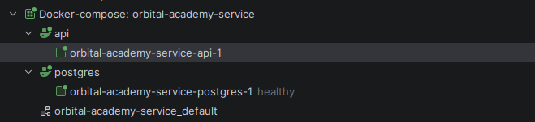
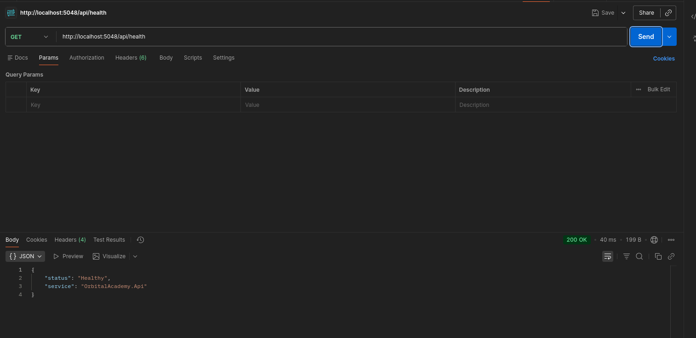
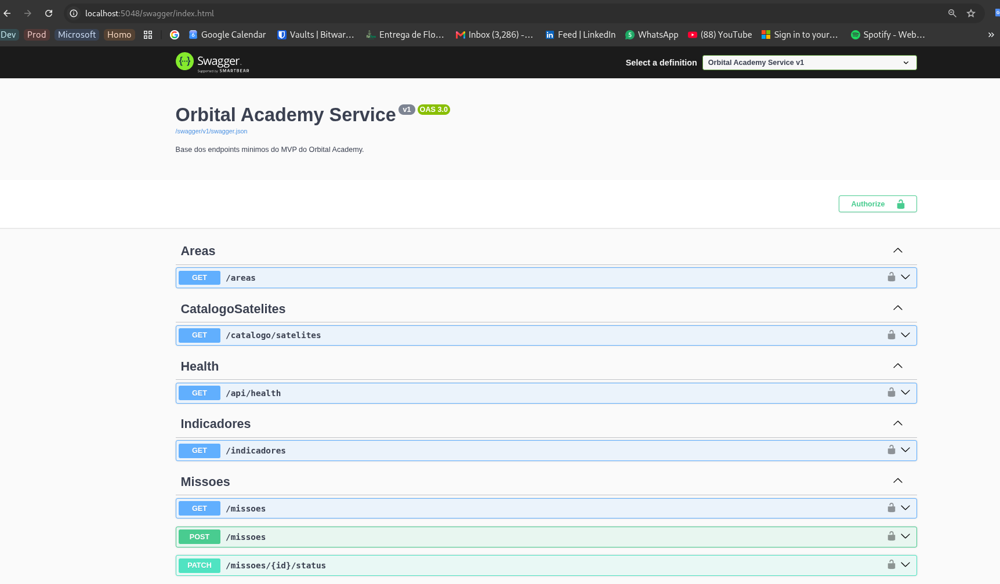
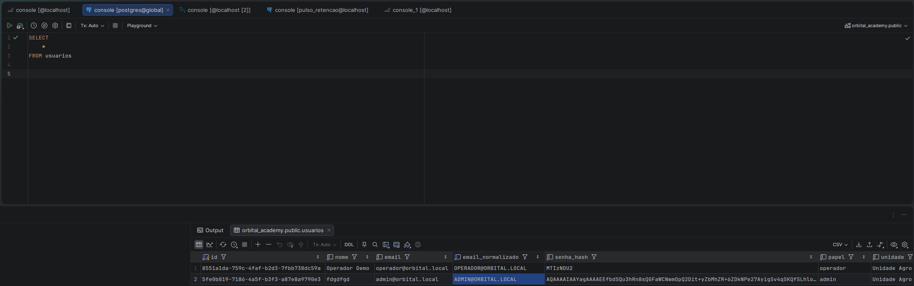
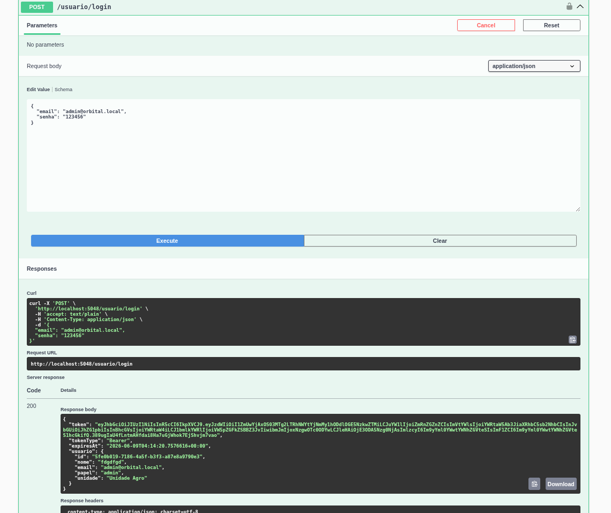

# Evidencias de execucao

Este arquivo registra evidencias de que o backend principal do Orbital Academy executa conforme a arquitetura documentada. As imagens foram mantidas em `evidencias/` e os comandos abaixo usam apenas dados locais de demonstracao.

## Docker e build da aplicacao

O projeto pode ser iniciado com Docker Compose, subindo a API ASP.NET Core e o PostgreSQL local. O arquivo `docker-compose-example.yml` serve como modelo seguro para recriar a configuracao sem versionar credenciais reais.



## Health check

Com a API em execucao, a rota publica de health check confirma que o servico esta respondendo.



## Swagger e rotas da API

Em ambiente de desenvolvimento, o Swagger exibe os endpoints disponiveis da API, incluindo login, catalogo, areas, ranking, missoes, validacao, otimizacao e indicadores.



## Usuario inicial e banco de dados

O projeto nao versiona senha ou credenciais reais. Para demonstracao, um usuario inicial pode ser criado por variaveis de ambiente:

```bash
export ORBITAL_INITIAL_USER_ENABLED=true
export ORBITAL_INITIAL_USER_EMAIL="operador@orbital.local"
export ORBITAL_INITIAL_USER_NOME="Operador Demo"
export ORBITAL_INITIAL_USER_PAPEL="operador"
export ORBITAL_INITIAL_USER_UNIDADE="Unidade Agro"
export ORBITAL_INITIAL_USER_PASSWORD="senha-nao-versionada"

docker compose up --build
```

A persistencia usa PostgreSQL com EF Core/Npgsql. A tabela `usuarios` armazena senha apenas como hash e possui indice unico para `email_normalizado`.



## Login, JWT e endpoint protegido

Depois do seed de demonstracao, a rota publica `POST /usuario/login` autentica por email e senha e retorna um JWT local HS256. O token e usado no Swagger ou em chamadas HTTP no formato `Authorization: Bearer <token>` para acessar endpoints protegidos, como `GET /catalogo/satelites`.



## Testes automatizados

A suite foi executada com o SDK .NET 10 usando:

```bash
dotnet test OrbitalAcademy.sln --no-restore
```

Resultado validado:

```text
Passed: 65
Failed: 0
Skipped: 0
```

Os testes cobrem convencoes de arquitetura, autorizacao explicita em controllers, configuracoes de CORS e JWT, login, geracao de token, seed de usuario inicial, mapeamento EF Core, dominio do catalogo e tratamento seguro de erro no controller de catalogo.
