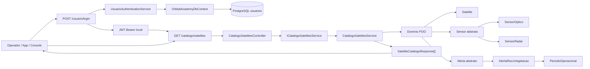
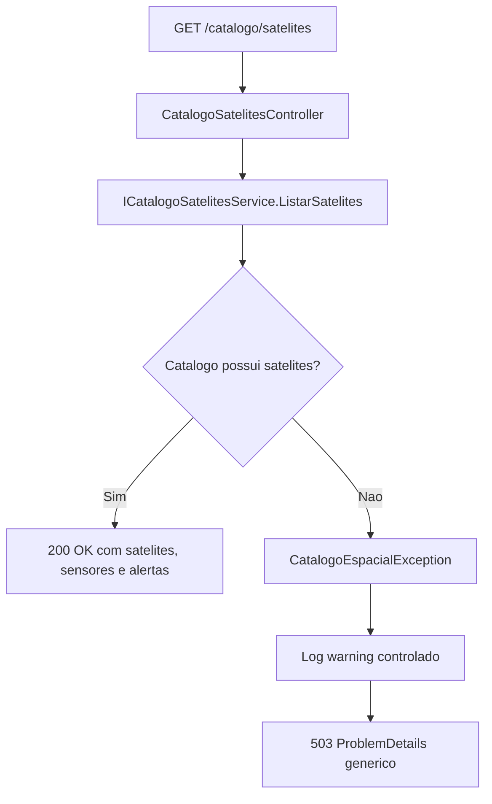

# Fluxo do catalogo C#

Este diagrama resume o fluxo demonstravel do servico .NET de catalogo espacial, alinhado ao documento base: API em C#/.NET, modelagem POO de Satelite/Sensor/Alerta, DI, tratamento de erro especifico e endpoint web service.

## Fluxo HTTP autenticado

## Tratamento de erro do catalogo

## Evidencia esperada

- Sem token: `GET /catalogo/satelites` retorna `401 Unauthorized`.
- Com token valido: `GET /catalogo/satelites` retorna `200 OK`.
- Retorno autenticado validado em 2026-06-04:
  - 2 satelites: `Landsat` e `Sentinel`;
  - sensores `optico` e `radar`;
  - alertas `risco-vegetacao`.

## Observacoes

- O catalogo permanece em memoria nesta fase.
- PostgreSQL e EF Core sao usados no fluxo de usuario/login e seed inicial.
- Persistencia final do catalogo espacial ainda depende de fase futura autorizada.
